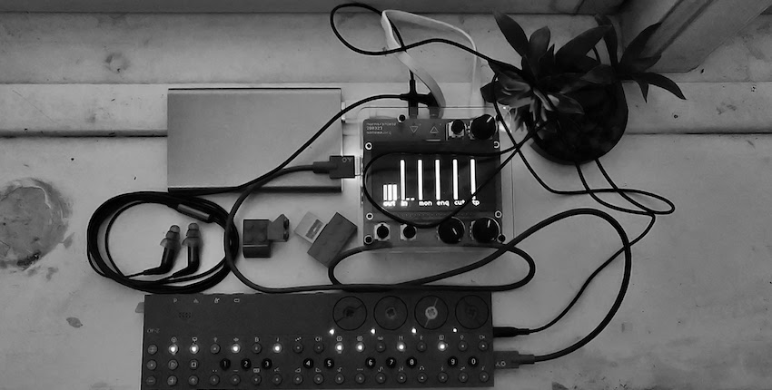
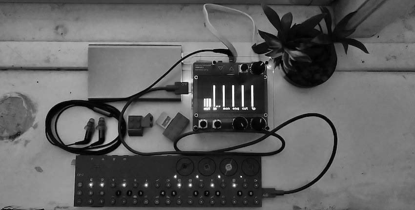
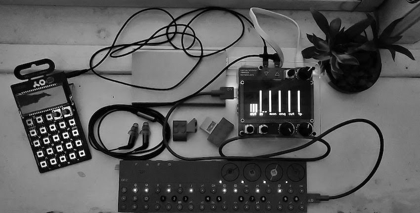

# Connect OP-Z

Connect OP-Z as an audio device on norns.

This norns program has a single purpose, namely to connect monone
norns to teenage engineering OP-Z audio over USB for both input and
output.

I hope to improve my setup in the following regards:

1. Audio signal from OP-Z headphones to norns input is weak and loses in quality when driving OP-Z at full volume. USB audio has more *umph*
1. OP-Z reserves the audio in jack of norns shield.
1. Less is more.

WARNING: Do not disconnect or turn off the OP-Z when it has been
connected as an audio device with this program. This will leave
processes running wild on the norns, and will produce loud digital
noise.

https://llllllll.co/t/using-usb-audio-with-norns-case-op-z/

# Requirements

* norns
* teenage engineering OP-Z

# Purpose

The following storyline illustrates the ambition, and success of this
program.

Original setup in which I have monome norns shield running on a
Raspberry Pi 3+ powered by a battery pack. Etymōtic ER2XR headphones
are connected to norns output, and OP-Z is connected both with a USB
cable for MIDI and with an audio cable for audio from OP-Z to norns.

In a simplified setup the USB cable which I'll use anyway also
transport audio both ways, removing the audio cable from the setup and
also adding sound from norns to OP-Z.

An extended setup, now that the norns audio input is free for using
with a PO-28 Robot, PO-16 Factory or smartphone running YouTube,
SoundCloud, browser, Spotify, software synths like nanoloop and
Caustic, messaging apps etc. fun sound sources.

# Function

The way this program works is that is runs `alsa_in` and `alsa_out`
for the connected OP-Z, and routes them *softcut* and *crone* in
jack. This manipulates the audio stack under norns, which remains
ignorant of these changes.

Enabling input from OP-Z to norns and output from norns to OP-Z are
controlled separately.

# Plug-and-play

This thing can autodetect a connected OP-Z. To enable this feature

1. Symlink `99-opz.rules` into `/etc/udev/rules.d/`.
1. Register the rule with`sudo udevadm control --reload && sudo udevadm trigger` or restart norns.
1. Symlink `opz-audio-input.service` in `~/.config/systemd/user/`.
1. Register the service with `systemctl --user daemon-reload`.

There will be an audible glitch when the OP-Z is disconnected. Protect your hearing by turning down the volume.

If the disconnection fails and norns goes to a wild state, restart it.

# Further ideas

It might be worth looking at alternatives to `alsa_in` and `alsa_out`,
Jack 2 might have something for this.

Last idea would be to get a hardware mixer, rather then user norns as
my mixer.
